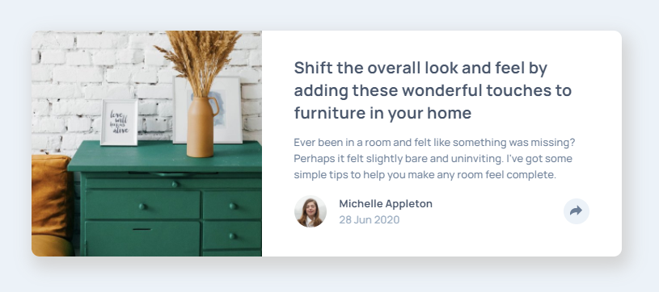
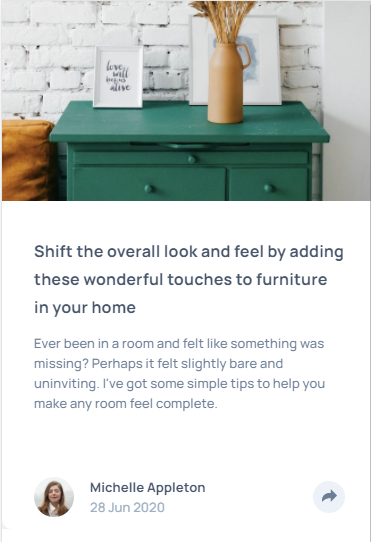

# Article-preview-component

## ✍🏻 Description
This is a challenge from [Frontend-Mentor](https://www.frontendmentor.io/challenges/article-preview-component-dYBN_pYFT).
The purpose of this challenge is to improve my skills with CSS and JS. 

## 🚀 Getting Started
Only need download the project and open index.html and given assets to use in project. Must add own CSS, classes, and other containers to html to get required results.

## 🎨 Preview

You can see the live result here → [Article Preview Component](https://mock-up-01-frontend-mentor-copy-article-preview-8l81w1ixy.vercel.app)

    
🖥 Desktop version

    
📱 Mobile version

## 👩🏻‍💻 Technologies
1. HTML
2. CSS
3. SASS
4. JavaScript